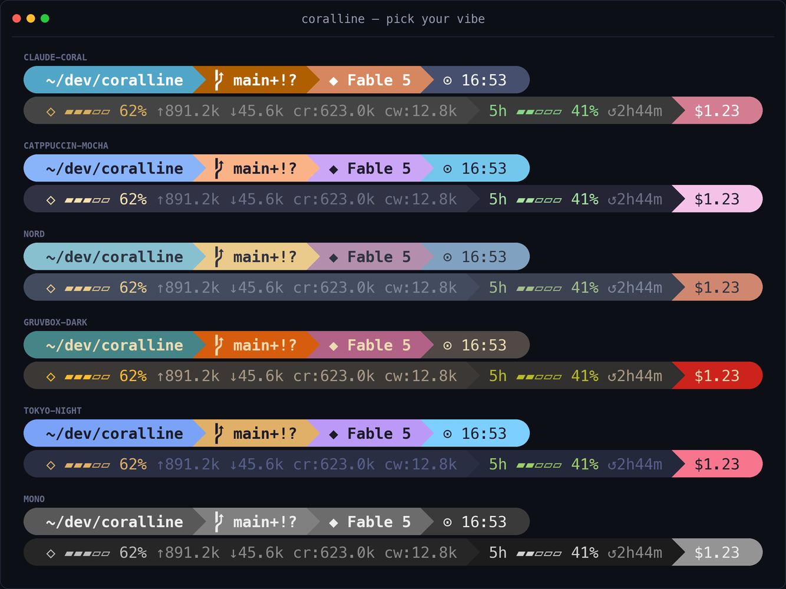
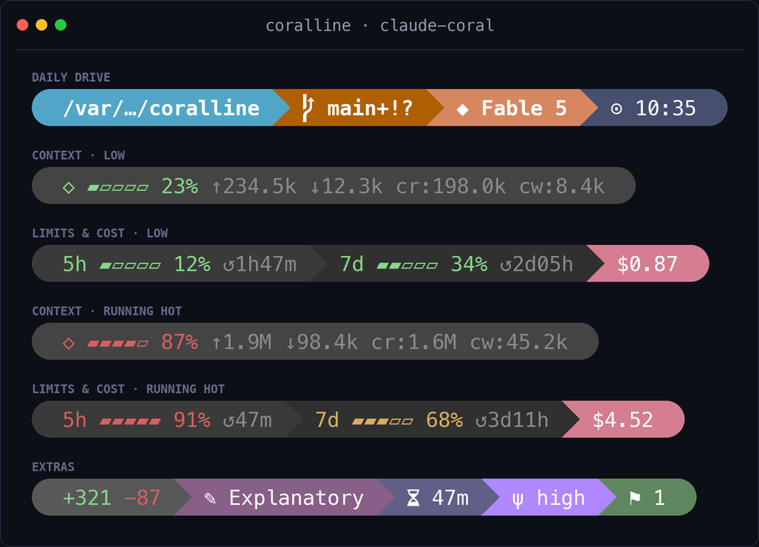
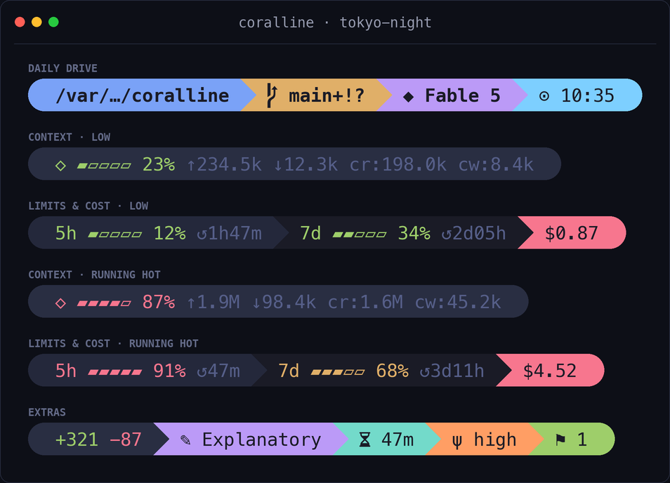
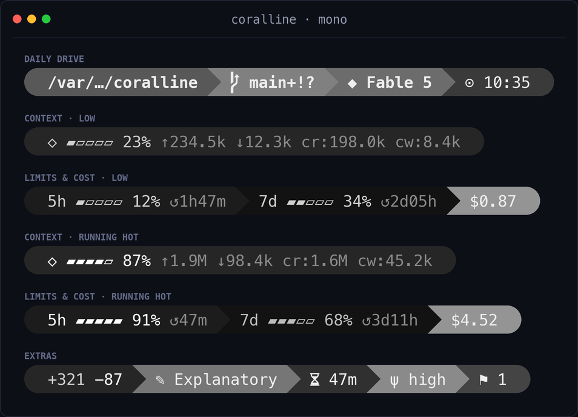
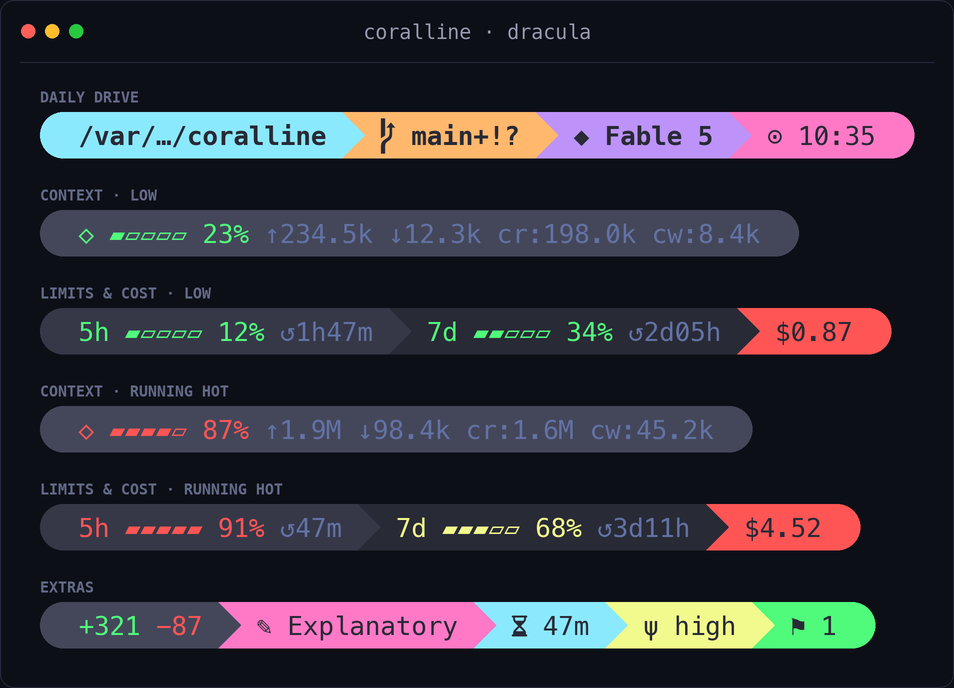
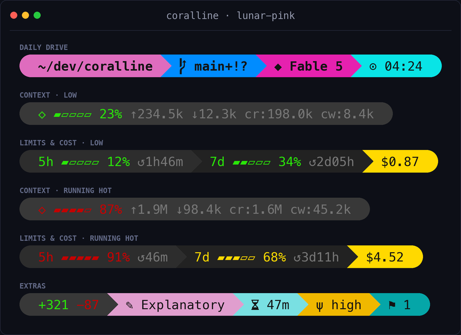
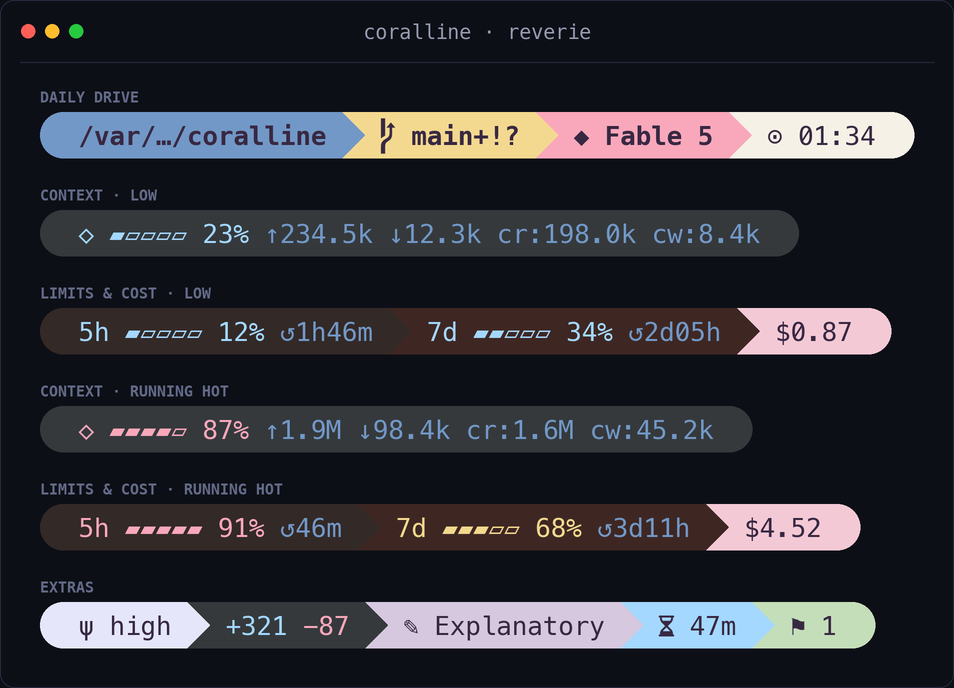
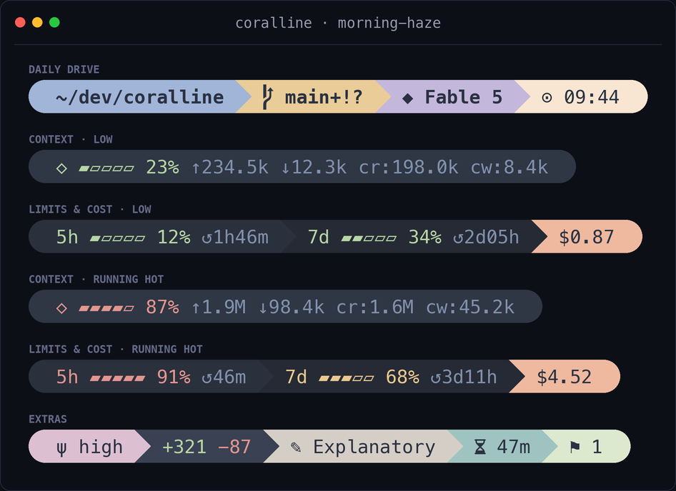

# coralline

> A [Powerlevel10k](https://github.com/romkatv/powerlevel10k)-inspired statusline for Claude
> Code with one installer entrypoint for humans and AI: run it directly, or ask Claude to run
> it and handle the setup for you.

[繁體中文說明](./README.zh-TW.md)



## What you get

```text
╭ ~/side-project/coralline  ⬢ coralline  ⎇ main+!  ◆ Fable 5  ψ high  ⬡ ▰▰▰▱▱ 62% ↑1.2M ↓45.6k  5h ▰▰▱▱▱ 41% ↺2h44m  7d ▰▰▰▰▱ 79% ↺1d11h  +321 −87  $1.23  ✎ Explanatory  ⧖ 47m  ⚑ 1  ⊙ 02:45 pm ╮
```

| Segment | Shows |
|---|---|
| `dir` | current directory, long paths collapsed to `~/a/…/z` |
| `project` | repo name (`⬢`), stable across every worktree; hidden outside a git repo |
| `git` | branch, staged `+` / modified `!` / untracked `?`, ahead `⇡` behind `⇣` |
| `node` | active Node version (Nerd Font `nf-dev-nodejs_small`) from `.nvmrc` / `.node-version` (or `node` on `PATH` with `VL_RUNTIME_PROBE=1`); hidden when undetected; opt-in |
| `python` | active Python env (Nerd Font `nf-dev-python`) — `$VIRTUAL_ENV` / conda (skips `base`) / `.python-version` (or `python3` on `PATH` with `VL_RUNTIME_PROBE=1`); hidden when undetected; opt-in |
| `model` | active Claude model |
| `effort` | reasoning effort level (`ψ`) — `low` / `med` / `high` / `xhigh` / `max` |
| `ctx` | context-window gauge, input/output/cache token counts |
| `limit5h` / `limit7d` | rate-limit gauges with reset countdown |
| `burn` | range-to-empty: projected time until the binding limit (5h or 7d) hits 100% at the recent burn rate (`↗`); opt-in by adding `burn` to `VL_SEGMENTS` |
| `lines` | lines added/removed this session |
| `cost` | session cost in USD |
| `style` | active output style |
| `duration` | session wall-clock duration |
| `stash` | git stash count |
| `clock` | time, 12h or 24h |

Gauges change color as they fill: green → yellow at 50% → red at 75% (thresholds configurable).

## Subagent panel

Claude Code shows an agent panel below the prompt while subagents run; each row
defaults to `name · description · token count`. coralline can theme the
**subagent rows** and add the per-task model, a context gauge, and elapsed time:

```text
 scout · Explore config sources ◆ gpt-5.6-luna ⬡ ▰▰▱▱▱ 21% 42.0k ⧖ 2m05s
 executor · Apply R2 fixes ◆ Fable 5 ⬡ ▰▰▰▰▱ 77% 155.0k ⧖ 45s
```


Claude Code v2.1.211 does not include its internal `agentType` role in the
`subagentStatusLine` payload, but local Agent tasks have a small metadata
sidecar next to the session transcript. coralline reads that file with Bash
builtins, so roles such as `scout` and `executor` return without another
process. The row keeps both identity and task label: an explicit per-task
`name` is retained alongside the role when both exist, followed by `label` or
`description`. If the sidecar is absent or unreadable, the payload fields still
render normally.

The model comes directly from Claude Code's per-task `model` payload field;
coralline never infers it from the main-session model or the agent role. Known
Claude IDs are shortened (`claude-haiku-4-5-…` → `Haiku 4.5`), while unknown or
gateway IDs such as `gpt-5.6-luna` are shown verbatim.

Enable or disable the renderer directly:

```bash
bash ~/.claude/coralline/configure.sh --subagent-rows=on
bash ~/.claude/coralline/configure.sh --subagent-rows=off
```

The setup wizard offers the same toggle. Disabling removes only the
`subagentStatusLine` entry and preserves every other Claude setting.

Per-task `model` and `contextWindowSize` need Claude Code **v2.1.205+**. Missing
fields degrade one segment at a time: no model hides only the model segment;
`tokenCount` still renders as a bare count without `contextWindowSize`; and the
rest of the row remains themed. Refresh is panel-event-driven rather than a
fixed one-second poll, so elapsed time changes when Claude Code redraws the
panel.

Live payloads currently expose no per-task *effort*. coralline does not reuse
the main-session effort or guess from the role; effort can be added only if
Claude Code exposes it later. The panel's native **main-session row remains
visible** because it is outside the `subagentStatusLine` protocol; only the
subagent rows are replaced and themed.

`VL_SUB_SEGMENTS` (default `"name model ctx elapsed"`) picks and orders the row
segments. These four are the complete set:

| Segment | Shows | Hidden when |
|---|---|---|
| `name` | task identity plus task label: explicit `name` and sidecar `agentType` compose when both exist, followed by payload `label` or `description`; `type` is the final fallback; colored by status via `VL_FG_SUB_*` — running: text color, completed: ok, failed: hot, missing/unknown: dim | every source is empty or unavailable |
| `model` | `◆` model from Claude Code's per-task payload; known Claude IDs are shortened and unknown/gateway IDs are shown verbatim | model not resolved yet, or pre-v2.1.205 |
| `ctx` | `⬡` context gauge + token count; bare count without `contextWindowSize` | no `tokenCount` |
| `elapsed` | `⧖` wall-clock since `startTime`, shown to the second (epoch s/ms or UTC ISO) | `startTime` missing or unparseable |

The renderer shares your config file but reads only the knobs that shape a row:
`VL_STYLE` with its per-style knobs — the pill caps and separator (`VL_CAP_L`,
`VL_CAP_R`, `VL_SEP`) and the lean/classic family (`VL_LEAN_SEP`, `VL_LEAN_BG`,
`VL_LEAN_CAP_L`/`VL_LEAN_CAP_R`, `VL_LEAN_FG`, `VL_BG_BAR`) — `VL_ASCII`,
`VL_NAME_MAX` (recommended — panel labels are long, and overlong rows are
clipped from the right, hiding model/ctx first), the gauge knobs
(`VL_BAR_WIDTH`, `VL_BAR_FILL`, `VL_BAR_EMPTY`, `VL_CTX_GLYPH`, `VL_WARN_PCT`,
`VL_HOT_PCT`),
the shared palette (`VL_FG_TEXT`, `VL_FG_DIM`, `VL_FG_OK`, `VL_FG_WARN`,
`VL_FG_HOT`), the row colors `VL_BG_SUB_NAME` / `VL_BG_SUB_MODEL` /
`VL_BG_SUB_CTX` / `VL_BG_SUB_ELAPSED` (empty = fall back to `VL_BG_DIR` /
`VL_BG_MODEL` / `VL_BG_CTX` / `VL_BG_DURATION`), and the name pill's per-status
text colors `VL_FG_SUB_TEXT` / `VL_FG_SUB_OK` / `VL_FG_SUB_HOT` /
`VL_FG_SUB_DIM` (empty = fall back to `VL_FG_TEXT` / `VL_FG_OK` / `VL_FG_HOT` /
`VL_FG_DIM`). The main palette is tuned for the gauge segments' dark ground, so
the built-in defaults and every bundled theme give the name pill that same dark
ground via `VL_BG_SUB_NAME` and keep the theme's own light inks; without it the
completed, failed, and unknown tints drop as low as 1.0:1 on a light pill. The
targets are checked against both that pill and the uniform bar `VL_STYLE="classic"`
paints instead. Setting `VL_BG_SUB_NAME=""` restores the light pill.
Everything else —
`VL_SEGMENTS*`, layout (`VL_LAYOUT`, `VL_MAX_LINES`, `VL_WRAP_MARGIN`), clock,
cost, lines, float, limit-sync, burn, git, and the runtime segments — is
main-bar-only and ignored here. To theme panel rows independently of the main
bar, point the registration at its own config file:
`CORALLINE_CONFIG=~/.claude/coralline-subagent.conf bash ~/.claude/coralline/statusline.sh --subagent`.

## Install

On macOS, Linux, and Windows environments with Bash, the install routes use `install.sh`.
PowerShell-only Windows uses the recommended native `install.ps1` route under
[Windows without Git Bash](#windows-without-git-bash). It needs only Windows PowerShell 5.1:
no Bash, Git, `jq`, WSL, or archive extractor.

> **Bash requirements:** `jq` and a [Nerd Font](https://www.nerdfonts.com/) terminal. No Nerd
> Font? Set `VL_ASCII=1` in your config for a glyph-free rendering. The native PowerShell
> renderer below does not require `jq`.

### Ask Claude (recommended)

Paste this into Claude Code:

```text
Please install coralline for me:
fetch https://raw.githubusercontent.com/Nanako0129/coralline/main/INSTALL.md
and follow the playbook in it.
```

Claude checks the environment first. In a Bash environment it uses `install.sh`, interviews
you, and can open the visual wizard. On PowerShell-only Windows it uses `install.ps1`, which
installs the native renderer and themes but does not provide a wizard or create
`coralline.conf`.

If your Claude flags the playbook and wants to inspect things first, that is the right
instinct, not an obstacle: see [Trust and security](#trust-and-security).

### Install it yourself

Run the Bash installer in your terminal:

```bash
curl -fsSL https://raw.githubusercontent.com/Nanako0129/coralline/main/install.sh | bash
```

When run interactively it asks which version to install — the latest tagged release
(recommended) or `main` (latest development). To skip the prompt, pin one explicitly with
`--ref`, e.g. `... | bash -s -- --ref v0.9.1` or `--ref main`.

### Manual

```bash
git clone https://github.com/Nanako0129/coralline ~/.claude/coralline-src
mkdir -p ~/.claude/coralline/themes
cp ~/.claude/coralline-src/statusline.sh ~/.claude/coralline/
cp ~/.claude/coralline-src/configure.sh ~/.claude/coralline/
cp ~/.claude/coralline-src/install.sh ~/.claude/coralline/
cp ~/.claude/coralline-src/themes/claude-coral.conf ~/.claude/coralline/themes/
```

Then add to `~/.claude/settings.json`:

```json
{
  "statusLine": {
    "type": "command",
    "command": "bash ~/.claude/coralline/statusline.sh",
    "refreshInterval": 1
  }
}
```

> **Note:** the commands above copy only the `claude-coral` theme. The Ask-Claude and one-line
> installers bundle every theme; after a manual install, copy the rest of
> `~/.claude/coralline-src/themes/*.conf` into `~/.claude/coralline/themes/` to switch themes.

### Windows without Git Bash

`statusline.sh` needs a bash to run it, so a PowerShell-only Windows machine (no Git for
Windows, no WSL) cannot use it at all — `install.sh` is itself a bash script. `statusline.ps1` is
a native Windows PowerShell 5.1 port that needs neither: no bash, no `jq`, only `git.exe` on
`PATH` for the `git`/`stash`/`project` segments (already required for those segments in the bash
version too).

It reads the exact same `~/.claude/coralline.conf` (and theme file) a bash install already
wrote, so nothing about the config format changes; only the renderer is new. The native main
bar supports the same segments, `pill`/`lean`/`classic` styles, `fixed`/`auto` layouts, burn
history, limit sync, and float publication as the bash renderer. The `--subagent` panel-row
protocol remains bash-only and exits without output in `statusline.ps1`.

The following is the **mutable `main`** one-line installer. It resolves `main` to a commit SHA,
downloads `install.ps1` from that SHA with a bounded `HttpWebRequest`, parses it before
execution, and launches the absolute `$PSHOME\powershell.exe` with the same SHA:

```powershell
& { $ErrorActionPreference='Stop';$repo='Nanako0129/coralline';$ref='main';if($repo -notmatch '^[A-Za-z0-9](?:[A-Za-z0-9-]{0,38})/[A-Za-z0-9._-]{1,100}$' -or $ref -notmatch '^[A-Za-z0-9][A-Za-z0-9._/-]*$' -or $ref.Length -gt 200 -or $ref.Contains('..') -or $ref.Contains('//') -or $ref.Contains('@{') -or $ref.EndsWith('/') -or $ref.EndsWith('.') -or $ref -match '(?i)(^|/)[^/]*\.lock($|/)'){throw 'invalid Repo or Ref'};$safe={param([string]$p,[string]$label,[bool]$cmd=$false);if([string]::IsNullOrWhiteSpace($p) -or $p -match '[\x00-\x1f\x7f-\x9f]' -or $p.StartsWith('\\') -or $p.StartsWith('//') -or $p.IndexOf(':',2) -ge 0){throw "$label is not a safe local path"};$full=[IO.Path]::GetFullPath($p).Replace('/','\');$root=[IO.Path]::GetPathRoot($full);if($root -notmatch '^[A-Za-z]:\\$'){throw "$label is not on a local drive"};$drive=New-Object IO.DriveInfo($root);if($drive.DriveType -eq [IO.DriveType]::Network){throw "$label is on a network drive"};if($cmd -and ($full.Contains('"') -or $full.Contains('%') -or $full.Contains('!'))){throw "$label is not cmd-safe"};$current=$root;foreach($part in $full.Substring($root.Length).Split(@([char]'\'),[StringSplitOptions]::RemoveEmptyEntries)){$current=[IO.Path]::Combine($current,$part);$item=Get-Item -LiteralPath $current -Force -ErrorAction SilentlyContinue;if($null -eq $item){break};if(($item.Attributes -band [IO.FileAttributes]::ReparsePoint) -ne 0){throw "$label contains a reparse point"}};if($full.Length -gt $root.Length){$full=$full.TrimEnd('\')};return $full};$fetch={param([uri]$uri,[long]$cap,[string]$label);if($uri.Scheme -cne 'https' -or ($uri.Host -cne 'api.github.com' -and $uri.Host -cne 'raw.githubusercontent.com') -or $uri.UserInfo -or $uri.Query -or $uri.Fragment){throw "unexpected $label URI"};$request=[Net.HttpWebRequest]::Create($uri);$request.Method='GET';$request.AllowAutoRedirect=$false;$request.Timeout=15000;$request.ReadWriteTimeout=15000;$request.UserAgent='coralline-bootstrap';$response=$null;try{$response=[Net.HttpWebResponse]$request.GetResponse();if($response.StatusCode -ne [Net.HttpStatusCode]::OK -or $response.ResponseUri.AbsoluteUri -cne $uri.AbsoluteUri){throw "$label request failed or redirected"};if($response.ContentLength -gt $cap){throw "$label Content-Length exceeds limit"};$input=$response.GetResponseStream();$memory=New-Object IO.MemoryStream;try{$buffer=New-Object byte[] 8192;$total=0L;while(($read=$input.Read($buffer,0,$buffer.Length)) -gt 0){$total+=$read;if($total -gt $cap){throw "$label stream exceeds limit"};$memory.Write($buffer,0,$read)};if($response.ContentLength -ge 0 -and $total -ne $response.ContentLength){throw "$label download was truncated"};return ,$memory.ToArray()}finally{if($null -ne $input){$input.Dispose()};$memory.Dispose()}}finally{if($null -ne $response){$response.Dispose()}}};$old=[Net.ServicePointManager]::SecurityProtocol;$tmp=$null;$made=$false;$code=0;try{[Net.ServicePointManager]::SecurityProtocol=[Net.SecurityProtocolType]::Tls12;$parts=$repo.Split('/');$commit=$ref;if($commit -cnotmatch '^[0-9a-f]{40}$'){$api=[uri]('https://api.github.com/repos/'+[uri]::EscapeDataString($parts[0])+'/'+[uri]::EscapeDataString($parts[1])+'/commits/'+[uri]::EscapeDataString($ref));$strict=New-Object Text.UTF8Encoding($false,$true);try{$payload=$strict.GetString((& $fetch $api 1MB 'commit resolution'))|ConvertFrom-Json}catch{throw ('commit resolution response is invalid: '+$_.Exception.Message)};if($null -eq $payload -or $payload.PSObject.Properties.Name -notcontains 'sha'){throw 'commit resolution response has no sha'};$commit=[string]$payload.sha;if($commit -cnotmatch '^[0-9a-f]{40}$'){throw 'commit resolution returned an invalid sha'}};$uri=[uri]('https://raw.githubusercontent.com/'+[uri]::EscapeDataString($parts[0])+'/'+[uri]::EscapeDataString($parts[1])+'/'+$commit+'/install.ps1');$bytes=& $fetch $uri 1MB 'installer';$tempRoot=& $safe ([IO.Path]::GetTempPath()) 'TEMP';$tmp=& $safe ([IO.Path]::Combine($tempRoot,('coralline-install-'+[guid]::NewGuid().ToString('N')+'.ps1'))) 'installer temp';$output=[IO.File]::Open($tmp,[IO.FileMode]::CreateNew,[IO.FileAccess]::Write,[IO.FileShare]::None);$made=$true;try{$output.Write($bytes,0,$bytes.Length);$output.Flush($true)}finally{$output.Dispose()};$checked=& $safe $tmp 'downloaded installer';if($checked -cne $tmp){throw 'installer temp identity changed'};$tokens=$null;$errors=$null;[void][Management.Automation.Language.Parser]::ParseFile($tmp,[ref]$tokens,[ref]$errors);if($errors.Count -ne 0){throw ('downloaded installer parse failed: '+$errors[0].Message)};$exe=& $safe ([IO.Path]::Combine($PSHOME,'powershell.exe')) 'PowerShell executable' $true;if(-not [IO.File]::Exists($exe)){throw 'trusted powershell.exe is missing'};$psi=New-Object Diagnostics.ProcessStartInfo;$psi.FileName=$exe;$psi.UseShellExecute=$false;$psi.Arguments='-NoLogo -NoProfile -NonInteractive -ExecutionPolicy Bypass -File "'+$tmp+'" -Repo "'+$repo+'" -Ref "'+$commit+'"';$process=New-Object Diagnostics.Process;$process.StartInfo=$psi;try{if(-not $process.Start()){throw 'installer child did not start'};$process.WaitForExit();$code=$process.ExitCode}finally{$process.Dispose()}}finally{[Net.ServicePointManager]::SecurityProtocol=$old;if($made -and $null -ne $tmp -and [IO.File]::Exists($tmp)){$checked=& $safe $tmp 'installer cleanup';if($checked -cne $tmp){throw 'refusing unexpected cleanup path'};$item=Get-Item -LiteralPath $tmp -Force;if(($item.Attributes -band [IO.FileAttributes]::ReparsePoint) -ne 0){throw 'refusing reparse-point cleanup'};[IO.File]::Delete($tmp)}};if($code -ne 0){exit $code} }
```

For an audited release or commit, copy the same line and replace only
`$ref='main'` with `$ref='AUDITED_TAG_OR_40_CHARACTER_COMMIT_SHA'`. A tag names a release but
can technically be moved; only an audited 40-character commit SHA makes the bootstrap URL
immutable. The bootstrap resolves a mutable name or tag before downloading executable code,
then the installer downloads every managed file from that same commit.

`install.ps1` installs `statusline.ps1` plus all ten themes, then losslessly merges only the
exact-case top-level `statusLine` member in `$HOME\.claude\settings.json`. It preserves
`$HOME\.claude\coralline.conf` byte-for-byte and never creates it. Existing runtime and settings
are backed up with timestamped sibling names when their managed content changes.

Rerun the same command to update. An identical rerun is a true no-op: no managed-file
replacement, settings rewrite, backup, or timestamp change. PowerShell-only installs do not include a
wizard; reuse an existing `coralline.conf` or edit one manually.

If the one-line bootstrap cannot run, download a GitHub source archive in the browser, inspect
it, extract it locally, and run the checked-out installer without network access:

```powershell
& "$PSHOME\powershell.exe" -NoLogo -NoProfile -NonInteractive -ExecutionPolicy Bypass -File C:\path\to\coralline\install.ps1 -SourceDirectory C:\path\to\coralline -InstallRoot "$HOME\.claude\coralline" -SettingsPath "$HOME\.claude\settings.json"
```

Run the wizard-written config from a bash install, or write `~/.claude/coralline.conf` by hand
(see any file under `themes/` for the shape); both work with `statusline.ps1` unchanged. The
per-process `ExecutionPolicy Bypass` lets the unsigned local renderer start when the normal
session default would otherwise be `Restricted`; it does not change any persisted policy, and
an enforced Group Policy still takes precedence.

### Updating

The two installer-driven routes below update Bash-based installs. Either way your
`~/.claude/coralline.conf` is preserved and the previous `statusline.sh` is backed up
under `~/.claude/coralline/` (the 3 newest are kept).

#### PowerShell-only update

Re-run the native one-line under [Windows without Git Bash](#windows-without-git-bash), using
the same `Repo` and `Ref`. It atomically replaces only managed files whose bytes changed, merges
the exact managed settings object only when needed, retains timestamped backups, and always
leaves `~/.claude/coralline.conf` untouched. Unmanaged files already under the runtime directory,
including burn/limit history, `float.txt`, and custom themes, remain in place and are never part
of the replacement transaction.

#### Ask Claude (recommended)

Paste this into Claude Code:

```text
Please update coralline for me:
fetch https://raw.githubusercontent.com/Nanako0129/coralline/main/UPGRADE.md
and follow the playbook in it.
```

Claude re-runs the installer, reads the "new since your installed copy" report, and
offers to turn on any new opt-in features for you.

#### Update it yourself

Re-run the installer — it prints a short "new since your installed copy" report when
something new shipped:

```bash
curl -fsSL https://raw.githubusercontent.com/Nanako0129/coralline/main/install.sh | bash -s -- --install-only
```

## Trust and security

The Ask-Claude install is a remote document that instructs an AI to run `curl | bash` and
touch `~/.claude/settings.json`. That shape is exactly what a prompt-injection attack looks
like, so a Claude that red-flags it before proceeding is behaving correctly. The answer to
that skepticism is inspection, not trust:

- **Read what runs.** Everything is in this repo. Bash environments use
  [install.sh](./install.sh); PowerShell-only Windows uses [install.ps1](./install.ps1).
  [INSTALL.md](./INSTALL.md) routes the AI between them. The PowerShell bootstrap is not
  `irm | iex`: it bounds and parses a temporary installer, then launches it as a file.
- **Pin a release.** `... | bash -s -- --ref v0.9.1` installs a tagged release instead of
  `main`, so what you audited is what you run. The interactive installer already offers the
  latest tag by default.
- **What gets written, exactly:** Bash setup writes its runtime, your approved config, and
  Claude settings as described above. The native installer writes only `statusline.ps1` and
  ten themes under `~/.claude/coralline`, plus the exact top-level `statusLine` value in
  `settings.json`. It never creates or edits `coralline.conf` and never writes
  `subagentStatusLine`. Changed existing runtime/settings get timestamped sibling backups.
- **What runs afterwards:** the registered Bash or PowerShell renderer runs on every prompt
  and makes zero network requests. The native command quotes the absolute trusted
  `$PSHOME\powershell.exe` and the absolute renderer path; it never searches the workspace
  for `powershell.exe`.
- **Why INSTALL.md addresses the AI:** humans get the visual wizard, AIs get an interview
  script, so the playbook speaks to the reader that executes it. A document that opens by
  addressing your AI deserves scrutiny, which is why every artifact it references lives in
  this repo where both of you can read it first.

### Uninstall

For a Bash-capable install, remove themed subagent rows before deleting the tools:

```bash
bash ~/.claude/coralline/configure.sh --subagent-rows=off
rm -rf ~/.claude/coralline ~/.claude/coralline.conf
```

Then delete the `statusLine` block from `~/.claude/settings.json` (or restore the newest
`settings.json.bak.*`). If you skipped the first command, also delete `subagentStatusLine`.

For a PowerShell-only native archive install, close Claude Code and back up the settings file:

```powershell
$settings = Join-Path $HOME '.claude\settings.json'
Copy-Item -LiteralPath $settings -Destination "$settings.bak.$(Get-Date -Format yyyyMMddHHmmss)"
notepad.exe $settings
```

In Notepad, delete the `statusLine` object whose command points to
`~/.claude/coralline/statusline.ps1`. Also delete `subagentStatusLine` if its command points
into coralline, then save valid JSON. Finally remove the installed runtime and optional config:

```powershell
Remove-Item -LiteralPath (Join-Path $HOME '.claude\coralline') -Recurse -Force
Remove-Item -LiteralPath (Join-Path $HOME '.claude\coralline.conf') -Force -ErrorAction SilentlyContinue
```

## Setup

Both Bash setup paths use the same installer. Humans run it with no mode and get the visual
setup. Claude uses it with `--install-only`, then follows `INSTALL.md` to interview you and
write config. The native PowerShell installer has no wizard and never writes config; it reads
the same `coralline.conf`, which can come from an existing Bash setup or be written manually.

### Setup modes

| Mode | Use when |
|---|---|
| Default | You want the coralline default immediately |
| Powerlevel10k import | You already have `~/.p10k.zsh` and want to carry over its style, time format, and main colors |
| Visual wizard | You want to preview themes, style, segments, wrapping, clock, and font compatibility before writing config |

Running the installer yourself with no mode opens the interactive setup. Claude should not
operate that TUI unless you explicitly ask for visual customization.

### Reconfigure

Both Bash install paths copy the wizard into `~/.claude/coralline`, so Bash-capable users can
rerun it anytime to restyle:

```bash
bash ~/.claude/coralline/configure.sh
```

PowerShell-only installs do not include a native wizard. Back up and edit
`$HOME\.claude\coralline.conf` manually, or reuse a config produced on a Bash-capable host.

### Testing a fork

Point the installer at the same fork:

```bash
curl -fsSL https://raw.githubusercontent.com/YOU/coralline/main/install.sh | bash -s -- --repo YOU/coralline
```

For PowerShell-only Windows, change both `$repo` and `$ref` in the native bootstrap. The
bootstrap validates them, resolves a mutable ref before downloading `install.ps1`, and passes
the resulting commit SHA to the installer for the fixed runtime allowlist.

## Configuration

Everything lives in `~/.claude/coralline.conf` (plain bash, sourced by the script):

| Variable | Default | Meaning |
|---|---|---|
| `VL_STYLE` | `pill` | `pill`: powerline pills · `lean`: flat colored text · `classic`: lean on a uniform dark bar (p10k classic) |
| `VL_LAYOUT` | `fixed` | `fixed`: one line per `VL_SEGMENTS*` var · `auto`: responsive |
| `VL_MAX_LINES` | `3` | `auto` only — wrap into at most this many lines (`1` = never wrap) |
| `VL_WRAP_MARGIN` | `4` | `auto` only — columns kept free on the right so segments never touch the edge |
| `VL_SEGMENTS` | `dir git model ctx limit5h limit7d cost clock` | segments on line 1, in order (the full list in `auto` mode) |
| `VL_SEGMENTS2` / `VL_SEGMENTS3` | _(empty)_ | `fixed` only — optional second/third line |
| `VL_CLOCK` | `12h` | `12h` / `24h` / `off` |
| `VL_CLOCK_SECONDS` | `1` | show seconds in the clock |
| `VL_BAR_WIDTH` | `5` | gauge width in cells |
| `VL_BAR_FILL` / `VL_BAR_EMPTY` | `▰` / `▱` | gauge glyphs |
| `VL_CTX_GLYPH` | `⬡` | glyph for the `ctx` segment |
| `VL_PROJECT_GLYPH` | `⬢` | glyph for the `project` segment |
| `VL_PATH_DEPTH` | `4` | collapse paths deeper than this |
| `VL_NAME_MAX` | `0` | max chars for the `project` / `git` names before `…` truncation (`0` = off) |
| `VL_COST_DECIMALS` | `2` | decimal places for the cost segment |
| `VL_WARN_PCT` / `VL_HOT_PCT` | `50` / `75` | gauge color thresholds |
| `VL_ASCII` | `0` | `1` disables Nerd Font glyphs |
| `VL_RUNTIME_PROBE` | `0` | `node` / `python`: `1` = also detect via `node` / `python3` on `PATH` when no pin file (forks per render) |
| `VL_BG_*` / `VL_FG_*` | theme | colors — `256`-color index or `"R,G,B"` |

The four glyph settings above — `VL_BAR_FILL`, `VL_BAR_EMPTY`, `VL_CTX_GLYPH`,
`VL_PROJECT_GLYPH` — are plain Unicode, not Nerd Font icons, so Nerd Fonts does not patch
them in and a font that lacks them leaves the substitution to your terminal's own font
fallback. If the substitute is wider than one cell it shoves the rest of the row out
of alignment — a squashed gauge, or a missing space before the percentage. Override them
with characters your terminal font actually carries. `▪` / `▫` for the gauge and `◔` for
`ctx` are present at exactly one cell in both Meslo and JetBrainsMono Nerd Font:

```sh
VL_BAR_FILL="▪" ; VL_BAR_EMPTY="▫" ; VL_CTX_GLYPH="◔"
```

### Burn-rate segment


Off by default. Add `burn` to `VL_SEGMENTS` to show a "range to empty" — the projected
time until whichever rate limit (5h or 7d) binds first, e.g. `↗ 5h ⇢ 1h58m`. Keys:
`CORALLINE_BURN_WINDOW` (recent-slope lookback, default 600s), `VL_BURN_GLYPH` (default
`↗`), `VL_BG_BURN` (defaults to the 5h background). While `burn` is in the segment list,
coralline writes samples to `~/.claude/coralline/burn-5h.tsv`; drop it from the list and
nothing is written.

The ETA is coloured by urgency against the window reset, and collapses to a glyph when a
number would be noise:

| You see | When |
|---|---|
| `↗ 5h ⇢ 1h58m` **red** | you'd empty *before* the window resets |
| `↗ 5h ⇢ 1h58m` **yellow** | reset and empty are a close call |
| `↗ 5h ⇢ 1h58m` **green** | the window resets with room to spare |
| **bright** `↗ ✓` | at this pace a full window can't run dry — a number like `24d15h` would just be noise |
| **dim** `↗ ✓` | idle: you've stopped burning, nothing in flight |
| **dim** `↗ …` | warming up: a cold start with no samples yet (deliberately *not* a green check, so a fresh install doesn't read as healthy) |

The label tells you which limit binds — whichever of `5h`/`7d` will hit 100% soonest.
`5h` only appears once you're burning hard enough to register at least two integer-%
steps within the recent window; at a light or steady pace there's no short-term slope to
fit, so the 7d projection binds and you see `↗ 7d`.

### Cross-session limit sync (optional)

`VL_LIMIT_SYNC=1` makes `limit5h` / `limit7d` show the freshest rate-limit reading any of your sessions has seen, instead of just this session's own snapshot. Each render records its `5h` / `7d` value to a small per-host store (`limit-5h.d` / `limit-7d.d`), and the segments display the highest percentage recorded for the current window. Off by default.

This exists because Claude Code re-renders a session's statusline only when that session is active, and the rate-limit numbers it passes are that session's last-seen values. So idle sessions show stale, divergent percentages. With sync on, every session converges to the latest known value the next time it redraws.

> **It only updates on redraw.** It cannot refresh a session that is not redrawing at all, and "latest known" is only as fresh as your most recently active session. coralline has no API access. So this narrows the gap between sessions, it does not make a fully idle bar live.

Single-session users gain nothing from it (there is only one snapshot), so it stays opt-in.

### Responsive layout

With `VL_LAYOUT="auto"` the bar stays on a single line while it fits, and greedily wraps into
up to `VL_MAX_LINES` rows when the window gets narrow. Once the line cap is reached, remaining
segments overflow on the last line. `VL_WRAP_MARGIN` keeps a few columns free on the right so
wrapped lines never butt against the window edge — raise it if your terminal adds padding.

Width comes from `$COLUMNS`. Claude Code v2.1.153+ sets `COLUMNS` to the current terminal width
before running the status line, so wrapping responds to window resizing out of the box. Outside
Claude Code the script falls back to `stty size` on the controlling terminal; if neither is
available it stays on one line.

```text
wide window:    ~/dev/app  ⎇ main  ◆ Fable 5  ⬡ ▰▰▰▱▱ 62%  5h ▰▰▱▱▱ 41%  $1.23  ⊙ 14:45

narrow window:  ~/dev/app  ⎇ main  ◆ Fable 5
                ⬡ ▰▰▰▱▱ 62%  5h ▰▰▱▱▱ 41%  $1.23  ⊙ 14:45
```

Prefer a layout that never moves? Keep `VL_LAYOUT="fixed"` and pin rows with
`VL_SEGMENTS` / `VL_SEGMENTS2` / `VL_SEGMENTS3`.

### Lean style

Prefer Powerlevel10k's *lean* look — no backgrounds, just colored text? Set
`VL_STYLE="lean"` and each segment's `VL_BG_*` color becomes its text accent instead:


| Variable | Default | Meaning |
|---|---|---|
| `VL_STYLE` | `pill` | set to `lean` for the flat look |
| `VL_LEAN_SEP` | _(empty)_ | extra text between segments, e.g. `·` |
| `VL_LEAN_FG` | _(empty)_ | force a text color; empty = inherit each segment's accent |
| `VL_LEAN_BG` | _(empty)_ | paint one uniform background behind the row — `"R,G,B"` or 256 index. For the full p10k *classic* look, prefer the `VL_STYLE="classic"` preset below — it wires this up for you |
| `VL_LEAN_CAP_R` | _(empty)_ | trailing cap glyph drawn in the `VL_LEAN_BG` color to bevel the bar's end into the terminal (p10k's end separator, e.g. `$''`); needs `VL_LEAN_BG` |
| `VL_LEAN_CAP_L` | _(empty)_ | leading cap glyph — the left-facing mirror of `VL_LEAN_CAP_R` at the bar's start (e.g. `$''`); needs `VL_LEAN_BG`. Stock p10k *classic* leaves it flat |

> **Tip:** already a p10k user? Tell the AI installer or the visual wizard to import your
> `~/.p10k.zsh` — it will carry over your style, colors, and time format after you opt in.
> See the [AI interview notes in INSTALL.md](./INSTALL.md#ai-interview).

### Classic style

Want Powerlevel10k's stock *classic* prompt — one uniform dark bar with colored
text and a solid end cap? Set `VL_STYLE="classic"`. It's a one-word preset: it
renders like `lean` on a dark bar (p10k's `POWERLEVEL9K_BACKGROUND`) with a
trailing powerline cap, no other knobs required.


| Variable | Default | Meaning |
|---|---|---|
| `VL_STYLE` | `pill` | set to `classic` for the p10k dark-bar look |
| `VL_BG_BAR` | _(empty → `238`)_ | the uniform bar color behind the row — `"R,G,B"` or 256 index. Any theme's palette rides this bar; grayscale palettes (e.g. `mono`) want an explicit `VL_BG_BAR` for contrast |

Under the hood `classic` is `lean` plus a `VL_LEAN_BG` (from `VL_BG_BAR`) and a
`VL_LEAN_CAP_R` end cap, so an explicit `VL_LEAN_BG` or cap still wins. Importing
a p10k *classic* config carries over your exact bar color and separator.

## Float readout (optional)

`VL_FLOAT=1` makes `statusline.sh` write a one-line **plain-text** readout to
`~/.claude/coralline/float.txt` on every render (segments from
`VL_FLOAT_SEGMENTS`, default `model ctx cost`). That's all coralline does —
it ships **no display carrier**. The file is the seam: pipe it wherever you want
a glanceable readout that stays visible without looking at Claude Code's bottom
statusline (a terminal status bar, tmux, a menu-bar app, …).

The readout is **plain text** (no ANSI color), so the default favors stable,
glance-friendly segments and leaves the color-driven limit warnings
(`limit5h` / `limit7d`) in the bottom statusline, where threshold colors work.
You can still add them to `VL_FLOAT_SEGMENTS` if you want the numbers up top.

**Config keys**

| Key | Default | Meaning |
|---|---|---|
| `VL_FLOAT` | `0` | `1` = write `float.txt` each render |
| `VL_FLOAT_SEGMENTS` | `model ctx cost` | segments rendered into the readout (plain text, no color) |
| `VL_FLOAT_SEP` | `  ·  ` | separator between segments |
| `VL_FLOAT_FILE` | `~/.claude/coralline/float.txt` | where the readout is written |

(Or toggle `VL_FLOAT` via "float readout" in `configure.sh`'s Details menu.)

A worked iTerm2 carrier (the `coralline-float` companion + setup steps) lives in
[`example/float-display-iterm2/`](example/float-display-iterm2/) — copy it into
your dotfiles and adapt. Other terminals (tmux, WezTerm, a menu-bar app, …) just
need to read `float.txt` the same way.

## Themes

| | |
|---|---|
| **`claude-coral`** — steel blue · mauve · Claude coral (default)<br> | **`catppuccin-mocha`** — soft pastels on dark<br> |
| **`nord`** — arctic frost<br> | **`gruvbox-dark`** — warm retro<br> |
| **`tokyo-night`** — neon on deep navy<br> | **`mono`** — grayscale minimalism<br> |
| **`dracula`** — cyan · pink · purple on charcoal<br> | **`lunar-pink`** — pink · cyan · yellow on near-black<br> |
| **`reverie`** — soft pastels · plum text on warm-dark<br> | **`morning-haze`** — hazy periwinkle · sage · sandstone on slate<br> |

A theme is just a `.conf` file assigning `VL_BG_*` / `VL_FG_*` — copy one, change the colors,
and source yours from `coralline.conf` instead. PRs with new themes are welcome.
The wizard discovers themes automatically from `themes/*.conf` and nested collections such as
`themes/best-themes/*.conf`, so adding a theme file does not require editing `configure.sh`.

> **Adding a theme?** Copy an existing `.conf`, set every `VL_BG_*` / `VL_FG_*`
> (including `VL_BG_EFFORT`; `VL_BG_BAR` is optional — only grayscale palettes need
> it, to keep the classic bar readable), keep the `_VL_SUB_*` block at the end
> (panel-row candidates plus the `_VL_SUB_FP` fingerprint, which lets a config that
> retints the palette after sourcing your theme fall back safely), add its name to
> the `THEMES` list in
> [`tools/render-screenshots.py`](./tools/render-screenshots.py), re-run it to generate
> `assets/theme-<name>.png`, and add a row to the table above. Please **don't regenerate
> `hero.png`** — it's a fixed sampler of the original six themes, not a full catalog.

## Platform support

| Platform | Status |
|---|---|
| macOS | ✅ supported (works on the stock bash 3.2) |
| Linux | ✅ supported |
| Windows + Git Bash | ✅ supported — Claude Code runs the status line through Git Bash when it's installed |
| Windows without Git Bash | ✅ supported for the main bar through native Windows PowerShell 5.1 |

> **Windows note:** the native PowerShell renderer needs neither Git Bash nor `jq`. `git.exe`
> is optional and only enables the `git`, `stash`, and `project` segments. The interactive
> wizard and themed `--subagent` rows remain bash-only.

## Why it's fast

The statusline is just a local shell script: it makes no network or API calls and uses zero
tokens. Claude Code pipes the session JSON to it on stdin and renders whatever it prints.

It runs every second (`refreshInterval: 1`), so the script is built to be cheap on CPU: one
`jq` invocation extracts every field at once, and one `git status --porcelain=v2 --branch`
call provides branch, dirty state, and ahead/behind together. No `bc`, no per-field subprocess
spam. Works on stock macOS bash 3.2 and any Linux bash.

## Support coralline

coralline makes no network or API calls and uses zero tokens at runtime. The
maintenance work is elsewhere: tracking Claude Code payload changes, optional
live subagent-panel checks, shell regressions, nine-theme screenshot and font
QA, and installer verification across macOS, Linux, and Windows with Git Bash.

Sponsorship helps cover the Claude access and maintainer time behind that
compatibility work while coralline remains MIT-licensed and free. If the
statusline makes your daily sessions clearer, you can support its continued
development on Patreon.

[](https://www.patreon.com/cw/Nanako0129/membership)

## Acknowledgements

The visual language of coralline — segmented pills, powerline transitions, the `⇡⇣` git
glyphs, gauges that shift color as they fill — is a loving tribute to
[Powerlevel10k](https://github.com/romkatv/powerlevel10k) by
[@romkatv](https://github.com/romkatv), which set the bar for what a fast, beautiful prompt
can be. Thanks also to the wider [powerline](https://github.com/powerline/powerline) lineage
that started it all, and to [Nerd Fonts](https://www.nerdfonts.com/) for the glyphs that make
the pill shapes possible.

As for the name: coralline algae build reefs one thin, colorful layer at a time —
and **coral·line** is exactly what this is: a line, in Claude's coral.

## License

[MIT](./LICENSE)
