<div align="center">

# coralline

**A [Powerlevel10k](https://github.com/romkatv/powerlevel10k)-inspired statusline for Claude Code.**

Ten themes, three styles, a themed subagent panel, and rate-limit forecasting.<br>
Pure Bash on macOS, Linux, and Git Bash, plus a native PowerShell renderer for Windows.

[](https://github.com/Nanako0129/coralline/releases/latest)
[](./LICENSE)
[](#platform-and-performance)

**English** · [繁體中文](./README.zh-TW.md)

[Quick start](#quick-start) · [Themes](#themes) · [Styles](#styles-and-layout) · [Segments](#segments) · [Subagent panel](#subagent-panel) · [Rate-limit tools](#rate-limit-tools) · [Configuration](#configuration) · [Install options](#install-options) · [Update](#update-reconfigure-and-uninstall)

</div>

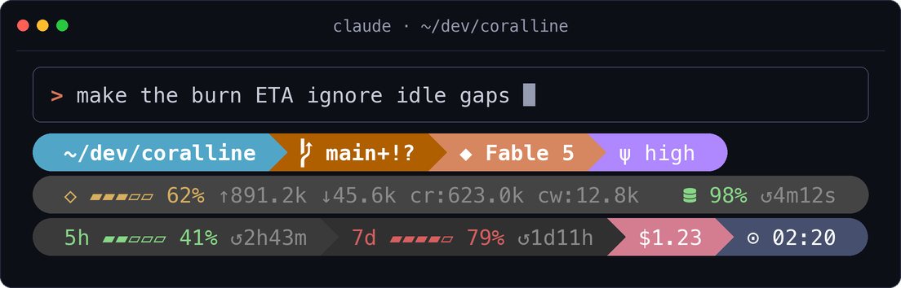

<p align="center"><sub>The default segments plus the opt-in <code>effort</code> and <code>cache</code>.</sub></p>

<table>
<tr>
<td width="50%" valign="top"><b>Ten themes, three styles.</b><br>From the default <code>claude-coral</code> to <code>nord</code>, <code>dracula</code>, and <code>tokyo-night</code>, drawn as powerline pills, flat lean text, or a p10k-style classic bar.</td>
<td width="50%" valign="top"><b>Limits you can plan around.</b><br>5-hour and 7-day gauges with reset countdowns, an opt-in burn-rate ETA, and optional sync of the open windows across sessions.</td>
</tr>
<tr>
<td valign="top"><b>A themed subagent panel.</b><br>Each subagent task gets its own row, colored by its status, with its model, context gauge, elapsed time, and optionally its reasoning effort.</td>
<td valign="top"><b>Fits the window.</b><br><code>VL_LAYOUT="auto"</code> wraps the bar over as many as <code>VL_MAX_LINES</code> rows as the terminal narrows.</td>
</tr>
<tr>
<td valign="top"><b>Costs nothing to run.</b><br>Local only: no network, no API calls, no tokens. The Bash bar parses each payload with one <code>jq</code> call, and a render runs at most one <code>git</code> call.</td>
<td valign="top"><b>Runs where Claude Code runs.</b><br>Stock macOS Bash 3.2, Linux Bash 4+, Git Bash, and a native Windows PowerShell 5.1 renderer.</td>
</tr>
</table>

## Quick start

> **Requirements:** the Bash renderer needs `jq` and a [Nerd Font](https://www.nerdfonts.com/) (set `VL_ASCII=1` for a glyph-free rendering). Git is optional and only enables git-backed segments. On Windows without Git Bash, use the [native PowerShell installer](#windows-without-git-bash) instead.

**Ask Claude.** Paste this into Claude Code:

```text
Please install coralline for me:
fetch https://raw.githubusercontent.com/Nanako0129/coralline/main/INSTALL.md
and follow the playbook in it.
```

Claude routes by environment, asks before changing preferences, and uses the appropriate installer. This fetches a mutable `main/INSTALL.md`; review it first or pin the playbook, installer, and payload to the same audited commit as described under [Trust and security](#trust-and-security).

**Or run the installer yourself** on macOS, Linux, or Git Bash:

```bash
curl -fsSL https://raw.githubusercontent.com/Nanako0129/coralline/main/install.sh | bash
```

It recommends the latest tagged release or lets you choose mutable `main`. Skip the prompt with `--ref v0.19.0` or another ref. If the one-line path cannot run, use the [manual fallback in `INSTALL.md`](./INSTALL.md#manual-fallback).

After installing, a setup menu offers the defaults, an import from `~/.p10k.zsh`, or a visual wizard that previews themes, styles, and segments before it writes your config. Reopen the wizard any time:

```bash
bash ~/.claude/coralline/configure.sh
```

## Themes

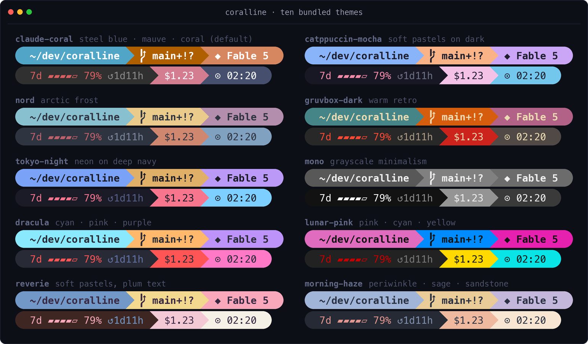

Bundled themes: `claude-coral`, `catppuccin-mocha`, `nord`, `gruvbox-dark`, `tokyo-night`, `mono`, `dracula`, `lunar-pink`, `reverie`, and `morning-haze`. A theme is a `.conf` file assigning `VL_BG_*` and `VL_FG_*`; the wizard discovers `.conf` files recursively under [`themes/`](./themes/).

Your `~/.claude/coralline.conf` usually starts by sourcing one:

```bash
. "$HOME/.claude/coralline/themes/claude-coral.conf"
```

To make your own, copy any theme file, change the colors, and source yours instead.

<details>
<summary><b>Full theme cards</b>: every theme at low and high usage, plus the extra segments</summary>
<br>

<table>
<tr>
<td>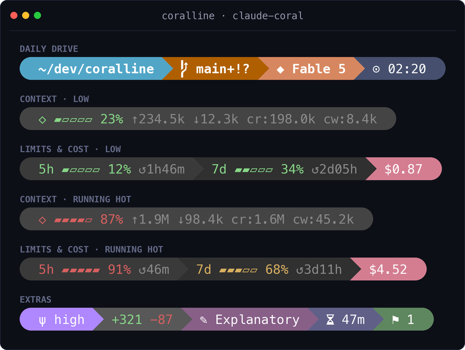</td>
<td>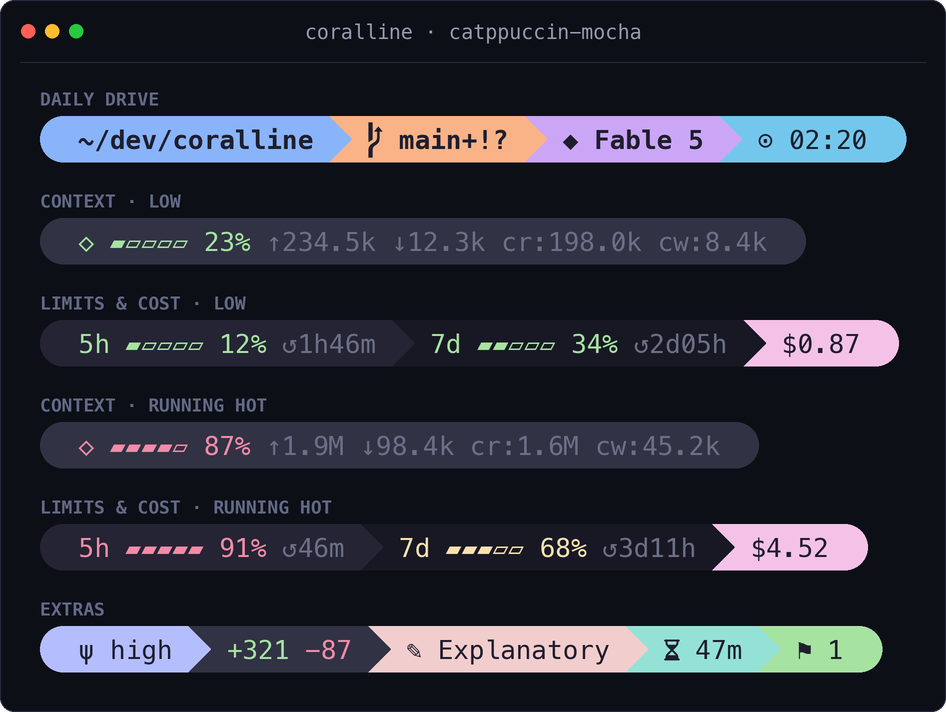</td>
</tr>
<tr>
<td>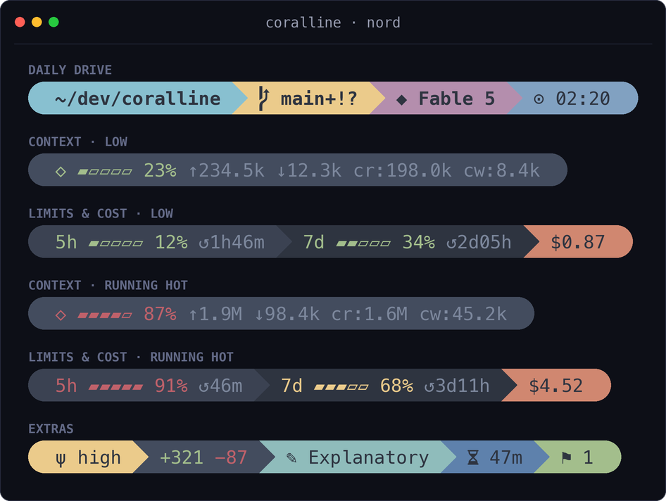</td>
<td>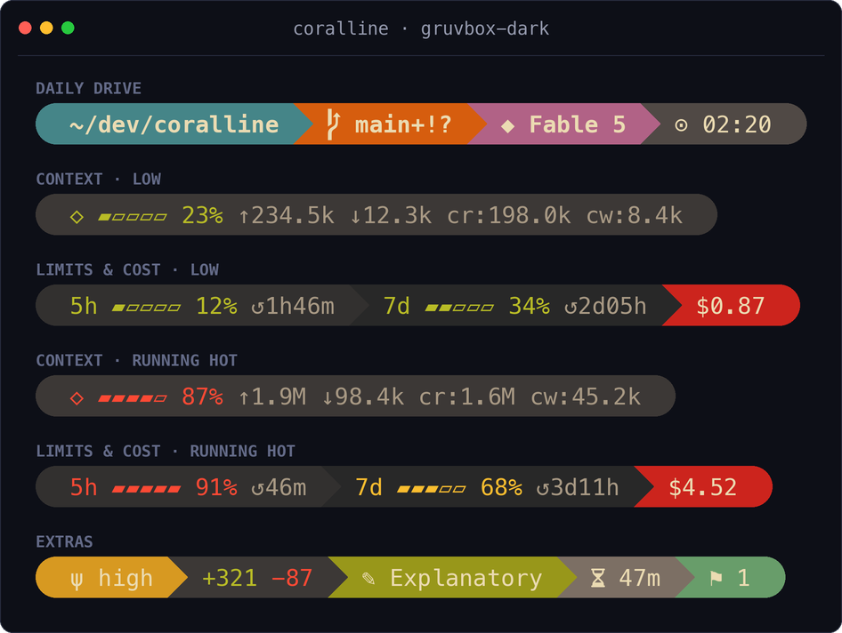</td>
</tr>
<tr>
<td>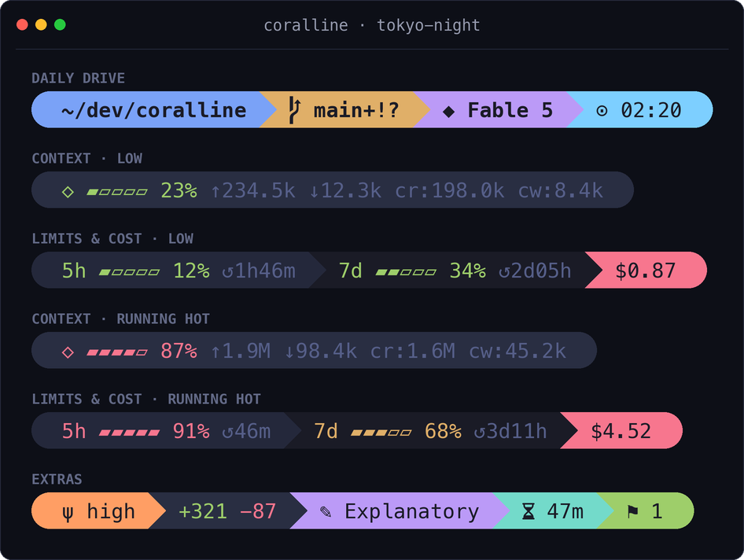</td>
<td>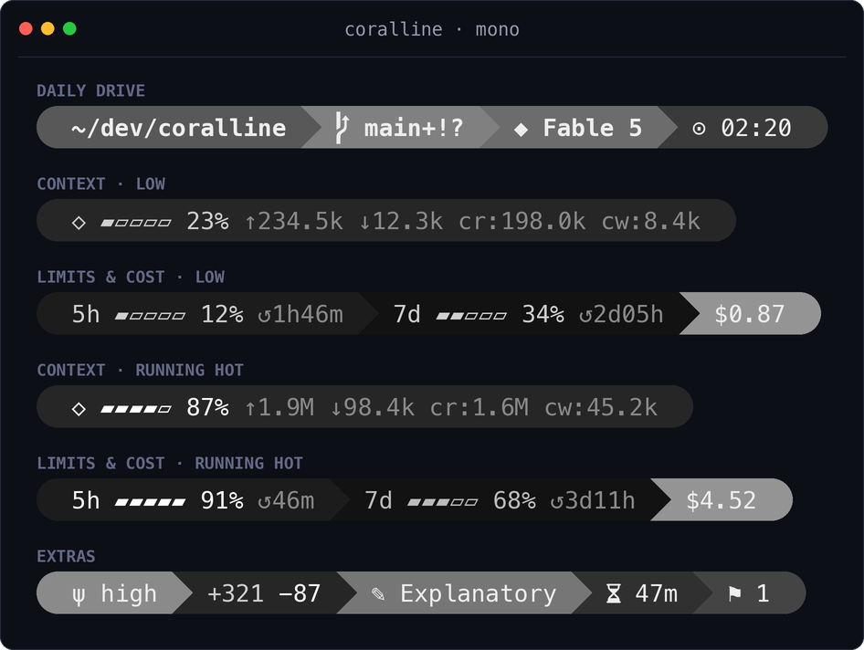</td>
</tr>
<tr>
<td>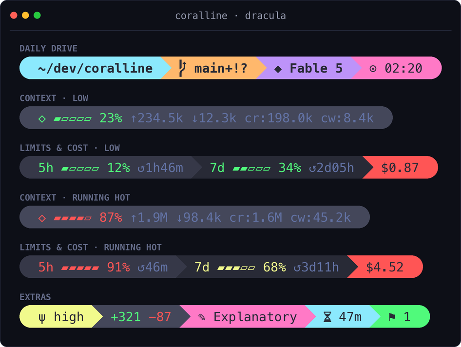</td>
<td>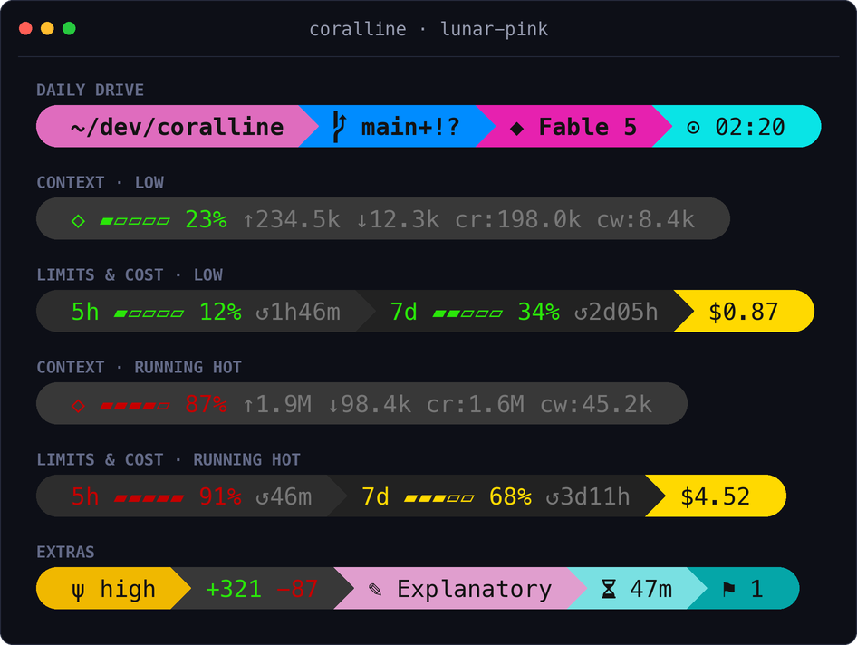</td>
</tr>
<tr>
<td>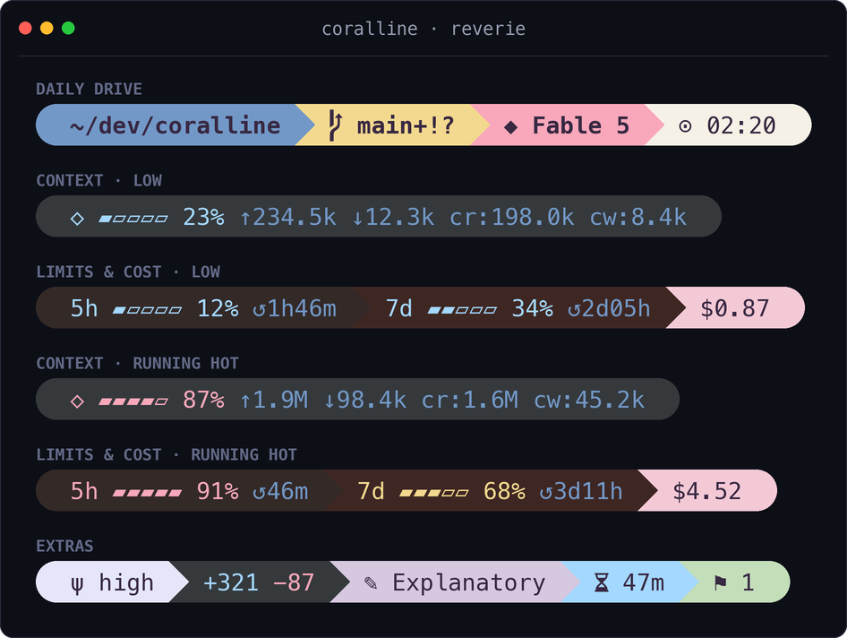</td>
<td>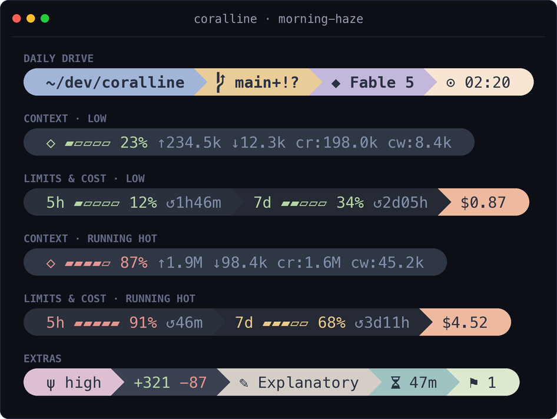</td>
</tr>
</table>

</details>

## Styles and layout

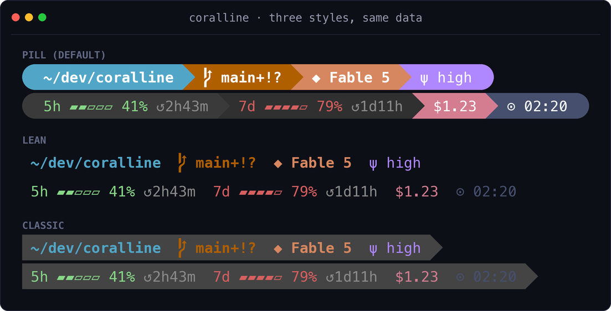

`VL_STYLE` changes the shape of the bar without touching the theme's colors, so any theme works with any style.

| Style | Result |
|---|---|
| `pill` | powerline pills with per-segment backgrounds |
| `lean` | flat colored text with optional separators, uniform background, and caps |
| `classic` | one-word preset for the p10k uniform dark bar and trailing cap ([PR #40](https://github.com/Nanako0129/coralline/pull/40)) |

The installer can import selected style, color, and clock values from `~/.p10k.zsh`; see the [`INSTALL.md` mapping](./INSTALL.md#ai-interview).

`VL_LAYOUT="auto"` measures display columns and wraps up to `VL_MAX_LINES`; Claude Code v2.1.153+ supplies `$COLUMNS`, with a terminal fallback outside Claude Code. The display-width implementation and portability rationale live in [PR #10](https://github.com/Nanako0129/coralline/pull/10).

<details>
<summary><b>Responsive wrapping</b>: one segment list at three line caps</summary>
<br>

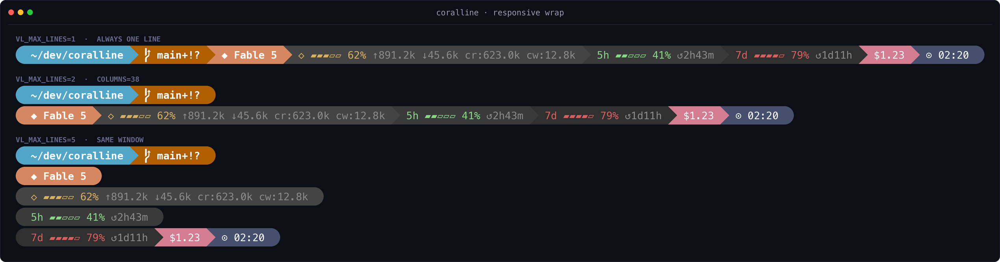

</details>

## Segments

The default bar is `dir git model ctx limit5h limit7d cost clock`; every other segment is opt-in. List segments in `VL_SEGMENTS`, or pick and reorder them in the wizard.

| Segment | Default | Shows |
|---|---|---|
| `dir` | yes | current directory, with long paths collapsed |
| `project` | no | repository name, stable across worktrees; hidden outside git |
| `git` | yes | branch, staged `+`, modified `!`, untracked `?`, ahead `⇡`, behind `⇣` |
| `node` | no | active Node version from a pin file, or `PATH` with `VL_RUNTIME_PROBE=1`; hidden when undetected |
| `python` | no | active virtualenv, conda, or pinned Python version, or `PATH` with `VL_RUNTIME_PROBE=1`; hidden when undetected |
| `model` | yes | active Claude model |
| `effort` | no | reasoning effort: `low`, `med`, `high`, `xhigh`, or `max` |
| `ctx` | yes | context gauge and input, output, and cache token counts |
| `cache` | no | prompt-cache hit ratio, and the countdown to the cache expiring or `cold` once it has |
| `toks` | no | decode speed of the last response in output tokens per second, prefill excluded; `≥` marks the prefill-inclusive fallback |
| `ttft` | no | time to first token of the last response; hidden when it cannot be derived |
| `limit5h` | yes | five-hour rate-limit gauge and reset countdown |
| `limit7d` | yes | seven-day rate-limit gauge and reset countdown |
| `burn` | no | projected time until the binding 5h or 7d limit reaches 100% |
| `lines` | no | lines added and removed in this session |
| `cost` | yes | session cost in USD |
| `style` | no | active output style |
| `duration` | no | session wall-clock duration |
| `stash` | no | git stash count |
| `clock` | yes | 12- or 24-hour clock |

Gauges change from green to yellow at 50% and red at 75%; both thresholds are configurable. `cache` reads the same thresholds inverted, because a high hit ratio is the good outcome: it turns yellow at 50% and red at 25%.

<details>
<summary><b>How <code>cache</code>, <code>toks</code>, and <code>ttft</code> are measured</b></summary>
<br>

`cache` needs Claude Code v2.1.263 or newer, which is where `prompt_cache` appears in the statusline payload. It hides itself before the session's first request. Below an hour the countdown carries seconds (`10m12s`, `42s`), above it does not (`1h06m`); once the cache has gone cold, or if it never went warm, the countdown is replaced by `cold`. The percentage is the session's cumulative hit ratio, so it stays accurate either way and is never zeroed: what the marker tells you is whether there is still a cache behind it. The countdown is the value at the last render, not a live clock: Claude Code refreshes the statusline on payload events (and once at the expiry itself), not every second, unless you set `statusLine.refreshInterval` in your settings.

`toks` is the decode speed of the last response: its output tokens, thinking tokens included, over the time from its first token to its last. `ttft` is the wait before that first token. The statusline payload carries neither, so when a response closes coralline reads the end of the session transcript once and derives both from it: each streamed block is stamped when it finishes, and a thinking block also records how long it streamed, which places the first token. A response that opens with text or a tool call has no such mark, so `ttft` hides and `toks` shows the prefill-inclusive rate instead, prefixed with `≥` because it can only understate the decode speed. That fallback is the response's output tokens over the API time that landed since the previous render (`total_output_tokens` in the payload is the last response's count, and `total_api_duration_ms` sums every request in the session); a subagent or side request finishing in the same interval makes it read low, and without `statusLine.refreshInterval` a subagent that runs between two responses is charged to the next one. Tool calls are never counted, because that total holds API time only. While either segment is in the list coralline keeps one small file per session in `~/.claude/coralline/toks-*` (the 32 most recent sessions), shows `… tok/s` until it has timed a response, and spends one `tail` and one extra `jq` on the render that closes a response (repeated at most twice more if the transcript has not caught up yet), never on the renders in between. Both hide before the session's first request. The wizard preview has no transcript, so it shows only the `… tok/s` placeholder and no `ttft`.

</details>

## Subagent panel

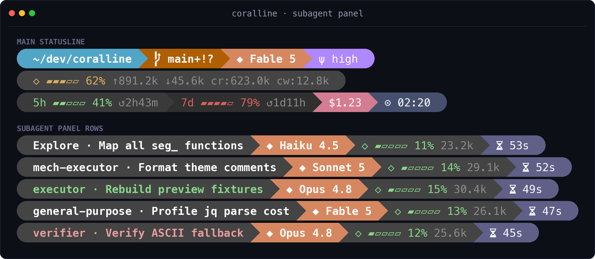

When Claude Code runs subagents it shows a panel of rows under the prompt. coralline can theme those rows and add each task's model, context gauge, and elapsed time. Turn the rows on or off explicitly:

```bash
bash ~/.claude/coralline/configure.sh --subagent-rows=on
bash ~/.claude/coralline/configure.sh --subagent-rows=off
```

Bash install-only and ordinary updates do not add or remove `subagentStatusLine`; only the wizard choice or explicit commands above change it. The native installer defaults to `-SubagentRows preserve`, and changes the setting only with explicit `on` or `off`.

| `VL_SUB_SEGMENTS` value | Shows |
|---|---|
| `name` | task identity and label, colored by status |
| `model` | per-task model |
| `effort` | per-task applied reasoning effort (opt-in; `VL_BG_SUB_EFFORT`, falls back to `VL_BG_EFFORT`) |
| `ctx` | context gauge and token count |
| `elapsed` | elapsed wall-clock time |

The default order is `name model ctx elapsed`. To add effort, use `VL_SUB_SEGMENTS="name model effort ctx elapsed"`.

<details>
<summary><b>Version requirements and fallbacks</b></summary>
<br>

Per-task model and context fields require Claude Code v2.1.205+. On v2.1.211, coralline recovers a missing local `agentType` role from the task sidecar; without the sidecar it still uses payload names and labels. Missing model or start time hides only the corresponding segment. `ctx` hides only when token count is missing or invalid; without a valid context size, it still shows the glyph and bare token count while omitting only the gauge and percentage. Rows redraw on panel events, not a one-second poll; the native main-session row remains. The opt-in `effort` segment shows the effort Claude Code actually sent for each local agent, read from the first response recorded in that agent's transcript, so agents without an `effort:` in their definition show the model default they ran at. It appears once the agent's first response is written and stays hidden on Haiku 4.5, where Claude Code sends no effort. It reads up to 64 lines of each transcript per panel redraw, which measured 6-12ms per task on macOS. The design and current fallback behavior are traced in [issue #45](https://github.com/Nanako0129/coralline/issues/45) and [PR #44](https://github.com/Nanako0129/coralline/pull/44).

</details>

## Rate-limit tools

### Burn-rate segment

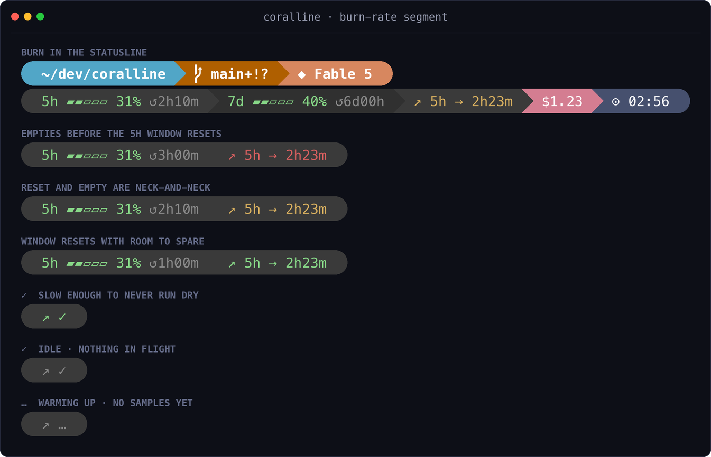

Add `burn` to `VL_SEGMENTS` to show the projected time until the binding 5h or 7d limit reaches 100%. It is off by default; while listed, it samples to `~/.claude/coralline/burn-5h.tsv`, and removing it stops writes. `CORALLINE_BURN_WINDOW` defaults to 600 seconds. The motivation and estimator contract are in [issue #17](https://github.com/Nanako0129/coralline/issues/17).

### Cross-session limit sync (optional)

Set `VL_LIMIT_SYNC=1` to let sessions that redraw share the account's open 5h and 7d windows through `limit-5h.d` and `limit-7d.d`. A session's valid reading always wins its own window; the store wins for a strictly newer window or when the session has no reading, using only a still-open stored window. It is off by default, has no API access, and cannot refresh an idle session. The store lives under `~/.claude/coralline`, or under `$CLAUDE_CONFIG_DIR/coralline` when that variable is set, as do the burn samples and the float file, so two Claude config directories keep separate state instead of overwriting each other's windows. See the original redraw-only contract in [PR #24](https://github.com/Nanako0129/coralline/pull/24) and the no-reading fallback in [PR #64](https://github.com/Nanako0129/coralline/pull/64).

### Float readout (optional)

Set `VL_FLOAT=1` to write a plain-text line to `~/.claude/coralline/float.txt` on each render. The default `VL_FLOAT_SEGMENTS` is `model ctx cost`. coralline ships no display carrier; the file is the integration seam, with an unsupported [iTerm2 example](./example/float-display-iterm2/) included. The design boundary is documented in [issue #15](https://github.com/Nanako0129/coralline/issues/15).

## Configuration

Bash reads `~/.claude/coralline.conf`; the native renderer can read the same file. It is sourced shell syntax, usually starting with one bundled theme:

```bash
. "$HOME/.claude/coralline/themes/claude-coral.conf"
```

| Variable | Runtime default | Meaning |
|---|---|---|
| `VL_STYLE` | `pill` | `pill`, `lean`, or `classic` |
| `VL_LAYOUT` | `fixed` | one row per `VL_SEGMENTS*`; `auto` wraps one list responsively |
| `VL_MAX_LINES` / `VL_WRAP_MARGIN` | `3` / `4` | line cap and right margin for `auto` |
| `VL_SEGMENTS` | `dir git model ctx limit5h limit7d cost clock` | first row, and the complete list in `auto` |
| `VL_SEGMENTS2` / `VL_SEGMENTS3` | empty | optional fixed second and third rows |
| `VL_CLOCK` / `VL_CLOCK_SECONDS` | `12h` / `1` | `12h`, `24h`, or `off`; seconds toggle |
| `VL_BAR_WIDTH` | `5` | gauge width |
| `VL_BAR_FILL` / `VL_BAR_EMPTY` | `▰` / `▱` | gauge glyphs |
| `VL_CTX_GLYPH` / `VL_PROJECT_GLYPH` / `VL_CACHE_GLYPH` | `⬡` / `⬢` / `⛁` | context, project, and cache glyphs |
| `VL_PATH_DEPTH` / `VL_NAME_MAX` | `4` / `0` | path collapsing and optional name truncation |
| `VL_COST_DECIMALS` | `2` | cost precision |
| `VL_CTX_ALWAYS_SHOW` / `VL_COST_ALWAYS_SHOW` | `0` / `0` | show valid missing/empty context or cost as zero |
| `VL_WARN_PCT` / `VL_HOT_PCT` | `50` / `75` | gauge color thresholds |
| `VL_ASCII` | `0` | disable Nerd Font glyphs when `1` |
| `VL_RUNTIME_PROBE` | `0` | let `node` and `python` probe `PATH` when no pin exists; adds forks per render |
| `VL_BG_*` / `VL_FG_*` | theme | 256-color index or `"R,G,B"` |

## Install options

The [quick start](#quick-start) covers Bash installs. This section covers PowerShell-only Windows and how to pin every download to one audited commit.

### Windows without Git Bash

`statusline.ps1` is the native Windows PowerShell 5.1 renderer. It needs no Bash, `jq`, WSL, archive extractor, or Git; `git.exe` is optional and only enables `git`, `stash`, and `project`. It supports the same main segments, styles, layouts, state-backed features, float output, and themed subagent rows as Bash.

The following bootstrap follows mutable `main`, resolves it to a commit before downloading executable installer code, then passes the same commit to `install.ps1`:

```powershell
& { $ErrorActionPreference='Stop';$repo='Nanako0129/coralline';$ref='main';$subagentRows="preserve";if($subagentRows -cnotin @("preserve","on","off")){throw "invalid SubagentRows"};$runtime="auto";if($runtime -cnotin @("auto","native","bash")){throw "invalid Runtime"};if($repo -notmatch '^[A-Za-z0-9](?:[A-Za-z0-9-]{0,38})/[A-Za-z0-9._-]{1,100}$' -or $ref -notmatch '^[A-Za-z0-9][A-Za-z0-9._/-]*$' -or $ref.Length -gt 200 -or $ref.Contains('..') -or $ref.Contains('//') -or $ref.Contains('@{') -or $ref.EndsWith('/') -or $ref.EndsWith('.') -or $ref -match '(?i)(^|/)[^/]*\.lock($|/)'){throw 'invalid Repo or Ref'};$safe={param([string]$p,[string]$label,[bool]$cmd=$false);if([string]::IsNullOrWhiteSpace($p) -or $p -match '[\x00-\x1f\x7f-\x9f]' -or $p.StartsWith('\\') -or $p.StartsWith('//') -or $p.IndexOf(':',2) -ge 0){throw "$label is not a safe local path"};$full=[IO.Path]::GetFullPath($p).Replace('/','\');$root=[IO.Path]::GetPathRoot($full);if($root -notmatch '^[A-Za-z]:\\$'){throw "$label is not on a local drive"};$drive=New-Object IO.DriveInfo($root);if($drive.DriveType -eq [IO.DriveType]::Network){throw "$label is on a network drive"};if($cmd -and ($full.Contains('"') -or $full.Contains('%') -or $full.Contains('!'))){throw "$label is not cmd-safe"};$current=$root;foreach($part in $full.Substring($root.Length).Split(@([char]'\'),[StringSplitOptions]::RemoveEmptyEntries)){$current=[IO.Path]::Combine($current,$part);$item=Get-Item -LiteralPath $current -Force -ErrorAction SilentlyContinue;if($null -eq $item){break};if(($item.Attributes -band [IO.FileAttributes]::ReparsePoint) -ne 0){throw "$label contains a reparse point"}};if($full.Length -gt $root.Length){$full=$full.TrimEnd('\')};return $full};$fetch={param([uri]$uri,[long]$cap,[string]$label);if($uri.Scheme -cne 'https' -or ($uri.Host -cne 'api.github.com' -and $uri.Host -cne 'raw.githubusercontent.com') -or $uri.UserInfo -or $uri.Query -or $uri.Fragment){throw "unexpected $label URI"};$request=[Net.HttpWebRequest]::Create($uri);$request.Method='GET';$request.AllowAutoRedirect=$false;$request.Timeout=15000;$request.ReadWriteTimeout=15000;$request.UserAgent='coralline-bootstrap';$response=$null;try{$response=[Net.HttpWebResponse]$request.GetResponse();if($response.StatusCode -ne [Net.HttpStatusCode]::OK -or $response.ResponseUri.AbsoluteUri -cne $uri.AbsoluteUri){throw "$label request failed or redirected"};if($response.ContentLength -gt $cap){throw "$label Content-Length exceeds limit"};$input=$response.GetResponseStream();$memory=New-Object IO.MemoryStream;try{$buffer=New-Object byte[] 8192;$total=0L;while(($read=$input.Read($buffer,0,$buffer.Length)) -gt 0){$total+=$read;if($total -gt $cap){throw "$label stream exceeds limit"};$memory.Write($buffer,0,$read)};if($response.ContentLength -ge 0 -and $total -ne $response.ContentLength){throw "$label download was truncated"};return ,$memory.ToArray()}finally{if($null -ne $input){$input.Dispose()};$memory.Dispose()}}finally{if($null -ne $response){$response.Dispose()}}};$old=[Net.ServicePointManager]::SecurityProtocol;$tmp=$null;$made=$false;$code=0;try{[Net.ServicePointManager]::SecurityProtocol=[Net.SecurityProtocolType]::Tls12;$parts=$repo.Split('/');$commit=$ref;if($commit -cnotmatch '^[0-9a-f]{40}$'){$api=[uri]('https://api.github.com/repos/'+[uri]::EscapeDataString($parts[0])+'/'+[uri]::EscapeDataString($parts[1])+'/commits/'+[uri]::EscapeDataString($ref));$strict=New-Object Text.UTF8Encoding($false,$true);try{$payload=$strict.GetString((& $fetch $api 1MB 'commit resolution'))|ConvertFrom-Json}catch{throw ('commit resolution response is invalid: '+$_.Exception.Message)};if($null -eq $payload -or $payload.PSObject.Properties.Name -notcontains 'sha'){throw 'commit resolution response has no sha'};$commit=[string]$payload.sha;if($commit -cnotmatch '^[0-9a-f]{40}$'){throw 'commit resolution returned an invalid sha'}};$uri=[uri]('https://raw.githubusercontent.com/'+[uri]::EscapeDataString($parts[0])+'/'+[uri]::EscapeDataString($parts[1])+'/'+$commit+'/install.ps1');$bytes=& $fetch $uri 1MB 'installer';$tempRoot=& $safe ([IO.Path]::GetTempPath()) 'TEMP';$tmp=& $safe ([IO.Path]::Combine($tempRoot,('coralline-install-'+[guid]::NewGuid().ToString('N')+'.ps1'))) 'installer temp';$output=[IO.File]::Open($tmp,[IO.FileMode]::CreateNew,[IO.FileAccess]::Write,[IO.FileShare]::None);$made=$true;try{$output.Write($bytes,0,$bytes.Length);$output.Flush($true)}finally{$output.Dispose()};$checked=& $safe $tmp 'downloaded installer';if($checked -cne $tmp){throw 'installer temp identity changed'};$tokens=$null;$errors=$null;[void][Management.Automation.Language.Parser]::ParseFile($tmp,[ref]$tokens,[ref]$errors);if($errors.Count -ne 0){throw ('downloaded installer parse failed: '+$errors[0].Message)};$exe=& $safe ([IO.Path]::Combine($PSHOME,'powershell.exe')) 'PowerShell executable' $true;if(-not [IO.File]::Exists($exe)){throw 'trusted powershell.exe is missing'};$psi=New-Object Diagnostics.ProcessStartInfo;$psi.FileName=$exe;$psi.UseShellExecute=$false;$psi.Arguments='-NoLogo -NoProfile -NonInteractive -ExecutionPolicy Bypass -File "'+$tmp+'" -Repo "'+$repo+'" -Ref "'+$commit+'"';$psi.Arguments+=" -SubagentRows "+[char]34+$subagentRows+[char]34;if($runtime -cne "auto"){$psi.Arguments+=" -Runtime "+[char]34+$runtime+[char]34};$process=New-Object Diagnostics.Process;$process.StartInfo=$psi;try{if(-not $process.Start()){throw 'installer child did not start'};$process.WaitForExit();$code=$process.ExitCode}finally{$process.Dispose()}}finally{[Net.ServicePointManager]::SecurityProtocol=$old;if($made -and $null -ne $tmp -and [IO.File]::Exists($tmp)){$checked=& $safe $tmp 'installer cleanup';if($checked -cne $tmp){throw 'refusing unexpected cleanup path'};$item=Get-Item -LiteralPath $tmp -Force;if(($item.Attributes -band [IO.FileAttributes]::ReparsePoint) -ne 0){throw 'refusing reparse-point cleanup'};[IO.File]::Delete($tmp)}};if($code -ne 0){exit $code} }
```

For an audited release or commit, copy the line and replace only `$ref='main'` with the selected tag or 40-character SHA. A branch or tag can move; the bootstrap resolves it before downloading. The native installer manages `statusline.ps1` and the ten shipped themes (plus `statusline.sh` when it selects the Bash runtime), precisely merges the top-level `statusLine`, preserves `subagentStatusLine` unless `on` or `off` is explicit, never creates or edits `coralline.conf`, and leaves custom themes, state, and float output outside its replacement set. See the current [`INSTALL.md`](./INSTALL.md) contract and the historical [native installer PR #55](https://github.com/Nanako0129/coralline/pull/55).

<details>
<summary><b>Refresh interval, runtime selection, and how each renderer reads <code>coralline.conf</code></b></summary>
<br>

For the native renderer, `install.ps1` writes `statusLine.refreshInterval: 2`, not `1`: Claude Code aborts an in-flight statusline render the moment the next refresh tick fires, and the native PowerShell renderer takes close to a second, so a 1-second tick can abort every render before it finishes. Re-running `install.ps1` replaces the whole `statusLine` value on every run, so an existing `refreshInterval` (whether `1`, `5`, or anything else) becomes `2` when the native renderer is selected and `1` when the Bash renderer is.

`install.ps1` also chooses which renderer Claude Code runs, through `-Runtime auto|native|bash` (the bootstrap's `$runtime`). The default, `auto`, selects the Bash renderer, `statusline.sh` run through Git Bash with `refreshInterval: 1`, when Git for Windows is installed for all users in its standard location (the `InstallPath` under `HKLM\SOFTWARE\GitForWindows`, else `%ProgramFiles%\Git`) and that `bash.exe` finds `jq`; otherwise it falls back to the native renderer. It prints the runtime it selected and, after a fallback, why. `-Runtime native` keeps the native renderer and never probes for Git Bash; `-Runtime bash` requires both Git Bash and `jq` and stops before changing anything when either is missing. Per-user Git installs and junctioned ones such as Scoop are not detected, so `auto` falls back to native there and `-Runtime bash` refuses them. The installer checks `jq` from its own environment; Claude Code runs the statusline from its own, so `jq` has to be reachable there too.

The two renderers treat `coralline.conf` differently. The Bash renderer sources it as shell code, so whatever it contains executes on every render; the native renderer parses it without executing anything. Under the default `auto`, a native install that reruns `install.ps1` on a machine with Git Bash and `jq` switches to the Bash renderer; whenever the installer selects the Bash renderer, under `auto` or `-Runtime bash`, it prints a note that the renderer executes `coralline.conf`. Set `$runtime="native"` in the bootstrap, or pass `-Runtime native`, to stay on the native renderer. Both renderers stay installed side by side, switching back to native never deletes `statusline.sh`, and a `subagentStatusLine` that holds the other runtime's coralline command for this install, or a Bash command for this install that names a different `bash.exe` (an older Git location), moves to the selected runtime even under `-SubagentRows preserve`.

</details>

### Trust and security

The default `main/INSTALL.md`, `main/UPGRADE.md`, and `main/install.sh` URLs are mutable remote inputs. Read the selected [`INSTALL.md`](./INSTALL.md), [`install.sh`](./install.sh), and [`install.ps1`](./install.ps1) before running them.

Passing `--ref <SHA>` to an installer already downloaded from `main` pins only the files it downloads next. To pin the initial Bash installer and its payload to the same audited commit, replace the placeholder below with one reviewed 40-character SHA:

```bash
SHA=YOUR_AUDITED_40_CHARACTER_COMMIT_SHA
audit_dir=$(mktemp -d "${TMPDIR:-/tmp}/coralline-audit.XXXXXX") || exit 1
(
  set -o pipefail
  trap 'cd / && rm -rf "$audit_dir"' EXIT
  cd "$audit_dir" || exit 1
  curl -fsSL "https://raw.githubusercontent.com/Nanako0129/coralline/$SHA/install.sh" | bash -s -- --ref "$SHA"
)
```

The unique temporary directory prevents stdin-executed Bash from treating a surrounding coralline checkout as its local source. Bash `--install-only` and updates do not edit `coralline.conf`; the wizard or AI changes it only after showing and receiving approval for the proposed change. Bash backs up `settings.json` and performs a semantic `jq` merge, so unrelated settings are retained but original formatting is not promised. The native installer follows the narrower managed/unmanaged boundary described above. Both renderers make no network requests after installation.

## Update, reconfigure, and uninstall

### Updating

Ask Claude to follow the upgrade playbook:

```text
Please update coralline for me:
fetch https://raw.githubusercontent.com/Nanako0129/coralline/main/UPGRADE.md
and follow the playbook in it.
```

Or update a Bash install directly from a directory outside any coralline checkout:

```bash
curl -fsSL https://raw.githubusercontent.com/Nanako0129/coralline/main/install.sh | bash -s -- --install-only
```

<details>
<summary><b>Which ref an update installs, and how to update from an audited commit</b></summary>
<br>

The URLs above fetch mutable `main` playbook or bootstrap code. Run the direct updater outside a coralline checkout; inside one, the installer intentionally uses that checkout's files instead of downloading a remote payload. Outside a checkout, the Bash installer keeps `main` in non-interactive runs. In an interactive `--install-only` run, it asks which payload ref to install and defaults to the latest tagged release when that tag can be resolved; if release lookup fails, it keeps `main` without prompting. Pass `--ref main` to request the development payload explicitly. A previously pinned install does not make a later unpinned update immutable. For an audited update, fetch `UPGRADE.md` from one reviewed 40-character SHA, then run `install.sh` from that same SHA and a neutral temporary directory as above, passing the same SHA through `--ref`. Re-run the native bootstrap with the same selected ref for PowerShell-only Windows. The installer reports new opt-ins but preserves existing choices unless approved; see [issue #31](https://github.com/Nanako0129/coralline/issues/31) and the current [`UPGRADE.md`](./UPGRADE.md).

</details>

### Reconfigure

Bash-capable installs include the visual wizard:

```bash
bash ~/.claude/coralline/configure.sh
```

PowerShell-only installs have no native wizard; back up and edit `coralline.conf` manually or reuse one created on a Bash-capable host.

### Uninstall

The runtime directory can contain custom themes, burn and limit history, `float.txt`, and other unmanaged files. Back up anything you want to keep before deleting it. Also back up the current `~/.claude/settings.json`, then remove `statusLine` or `subagentStatusLine` only if its command still points to coralline; do not restore an old whole-file backup without comparing unrelated changes made since it was created.

<details>
<summary><b>Uninstall commands</b></summary>
<br>

For Bash-capable systems, inspect and edit the current settings before removing the runtime:

```bash
settings="$HOME/.claude/settings.json"
cp "$settings" "$settings.bak.$(date +%Y%m%d%H%M%S)"
"${EDITOR:-vi}" "$settings"
rm -rf "$HOME/.claude/coralline"
# Optional: remove your saved preferences too.
rm -f "$HOME/.claude/coralline.conf"
```

For PowerShell-only systems:

```powershell
$settings = Join-Path $HOME '.claude\settings.json'
Copy-Item -LiteralPath $settings -Destination "$settings.bak.$(Get-Date -Format yyyyMMddHHmmss)"
notepad.exe $settings
Remove-Item -LiteralPath (Join-Path $HOME '.claude\coralline') -Recurse -Force
# Optional: remove your saved preferences too.
Remove-Item -LiteralPath (Join-Path $HOME '.claude\coralline.conf') -Force -ErrorAction SilentlyContinue
```

</details>

## Platform and performance

| Platform | Support |
|---|---|
| macOS | stock Bash 3.2 |
| Linux | Bash 4+ / 5 |
| Windows with Git Bash | Bash renderer |
| Windows without Git Bash | native Windows PowerShell 5.1 renderer |

The renderer is local: no network or API calls and zero token use. The Bash main bar parses its payload with one `jq` call; both renderers use at most one `git status --porcelain=v2 --branch` call per render and no per-field subprocesses. Reproducible measurement guidance is in [BENCHMARK.md](./BENCHMARK.md), introduced in [PR #65](https://github.com/Nanako0129/coralline/pull/65).

## Support, acknowledgements, and license

If coralline improves your daily sessions, you can support its continued maintenance on Patreon.

[](https://www.patreon.com/cw/Nanako0129/membership)

coralline's visual language is a tribute to [Powerlevel10k](https://github.com/romkatv/powerlevel10k), the [powerline](https://github.com/powerline/powerline) lineage, and [Nerd Fonts](https://www.nerdfonts.com/).

[MIT License](./LICENSE)
